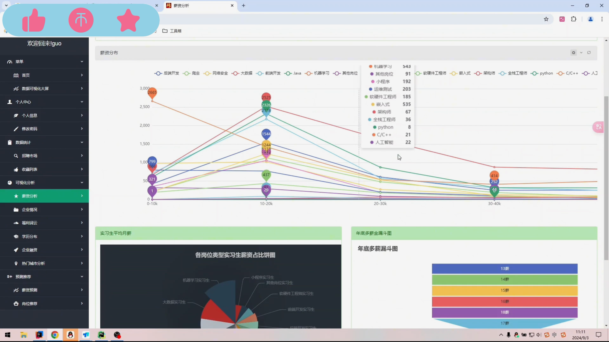
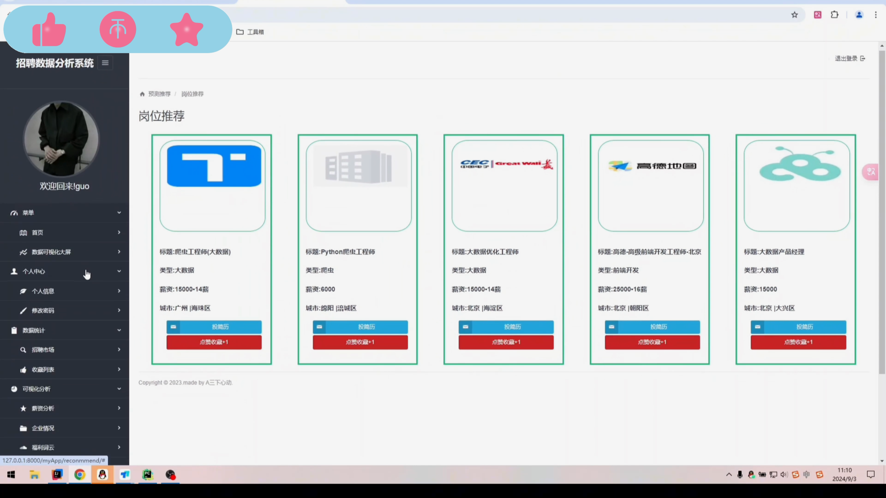
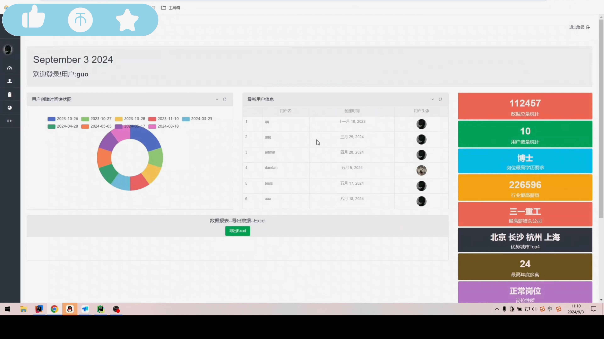
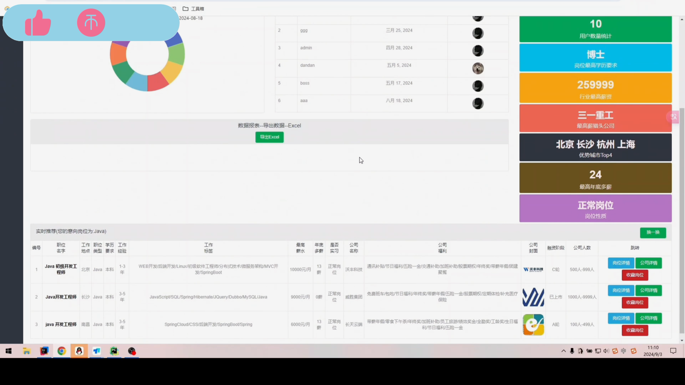
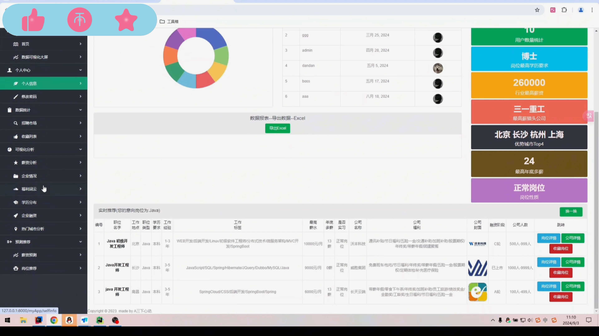
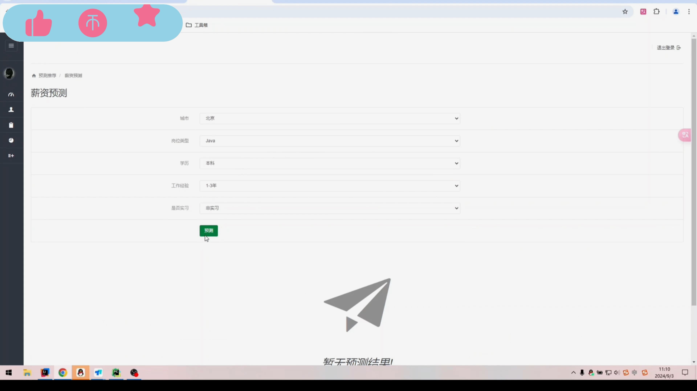
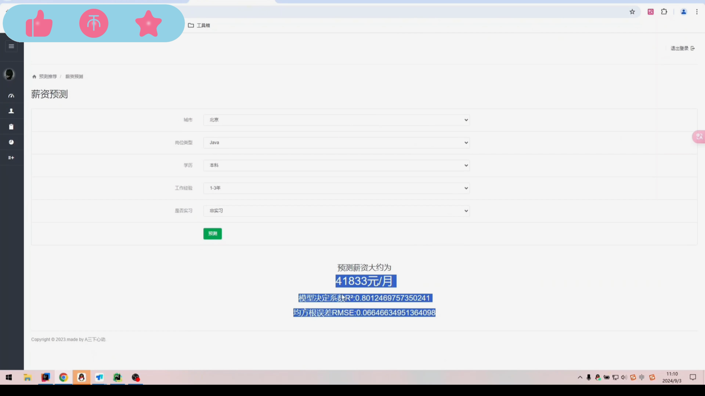
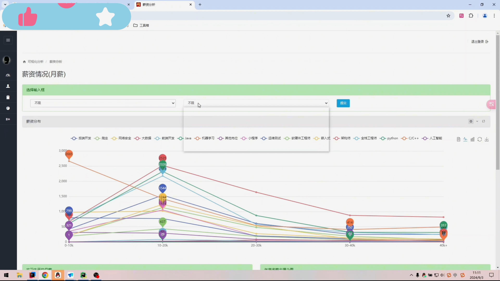

## 计算机毕业设计Pyspark+Hadoop招聘推荐系统 薪资预测 招聘可视化 招聘爬虫 机器学习 深度学习 JS逆向爬虫 大数据毕业设计

## 要求
### 源码有偿！一套(论文 PPT 源码+sql脚本+教程)

### 
### 加好友前帮忙start一下，并备注github有偿Spark招聘推荐
### 我的QQ号是2827724252或者798059319或者 1679232425或者微信:bysj2023nb

# 

### 加qq好友说明（被部分 网友整得心力交瘁）：
    1.加好友务必按照格式备注
    2.避免浪费各自的时间！
    3.当“客服”不容易，repo 主是体面人，不爆粗，性格好，文明人。

## 技术介绍：
后端基于Django框架开发
使用Echarts对数据库中20万条数据的19个维度可视化分析
对大数据量进行缓存优化
K近邻回归模型实现薪资预测
协同过滤推荐算法实现岗位推荐
结合实时推荐实现混合推荐解决冷启动问题
数据可视化大屏(Pyspark实时流处理➕Websocket)集成
Boss直骗数据采集爬虫程序(JS逆向/自动化都有实现保证爬虫高可用，长期稳定可运行)
功能丰富，全面
## 创新点：
数据可视化大屏
爬虫JS逆向
多维度数据可视化分析
算法实现
本系统含盖大数据的每个基本阶段流程：数据采集——数据处理——数据分析——算法实现
## 演示视频
https://www.bilibili.com/video/BV1ejm1Y1Eqp/
## 演示截图

